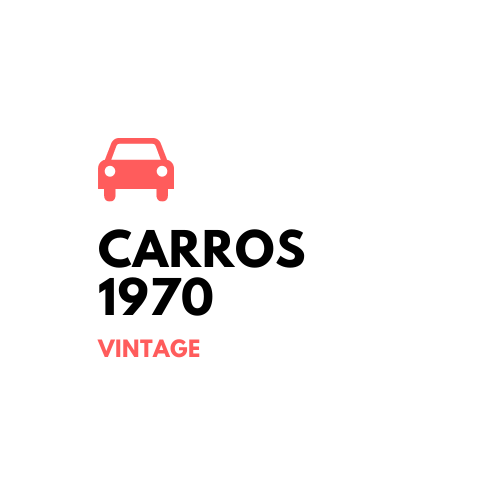
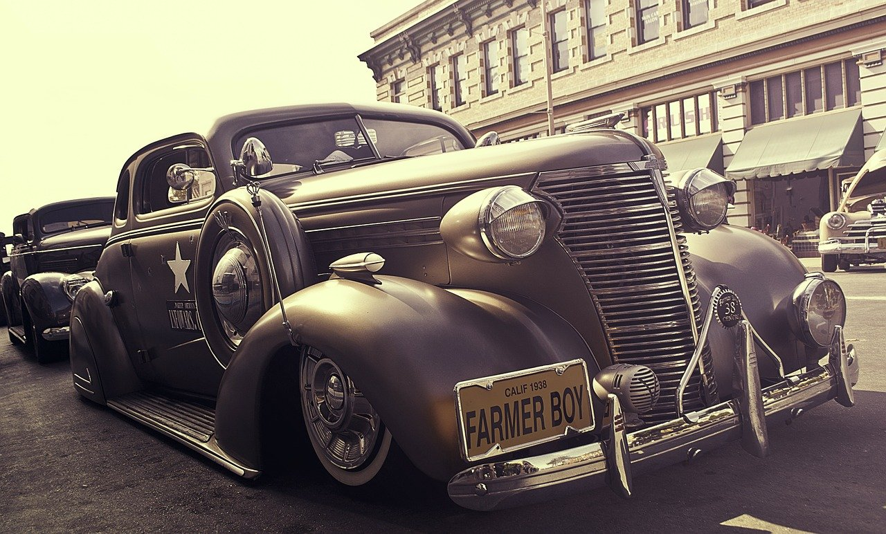

# cursoemvideo-html5
 Material do Curso de HTML5 e CSS3 do Curso em Vídeo
<!DOCTYPE html>
<html lang="pt-br">
<html>
	<head>
		<meta charset="UTF-8">
		<title>Carros 1970 - Vintage</title>
		<link rel="stylesheet" href="princi.css">
		<link rel="stylesheet" href="reset.css">
		<link href="https://fonts.googleapis.com/css?family=Montserrat&display=swap" rel="stylesheet">
		
	</head>

	<header>
			

				<h1></h1>	
					
				<nav>
					<ul>
						<li><a href="servicos.html">Serviços</a></li>	
						<li><a href="Contact.html">Contato</a></li>
						<li><a href="principal.html">Home</a></li>
					</ul>
				</nav>
			

	</header>

	
	
	  
	

	<body>

	

		<main>

			<section class="principal">

			<h1>Sobre a Carros 1970 - Vintage</h1>
			 
			
<strong>As décadas de 70 definitivamente foram marcantes,</strong> tanto que vira e mexe nos pegamos num clima nostálgico 
			relembrando das coisas boas desses anos que se passaram. De lá para cá, tivemos um salto enorme na evolução de muitas coisas.

			E não é à toa que tanta coisa nos marcou: os brinquedos, as guloseimas da infância, os filmes, a televisão e muito mais. E uma dessas coisas boas de se lembrar são os <strong>carros que marcaram época</strong>.

			 Através dessa idéia surge nosso site que traz para você, <strong>carros dos anos 1970 a 1980,</strong>não só relembrar e sim viver aquela época novamente.

			 
			 
			<h3>Na década de 50</h3>
				
Existiam carros antigos, amados por caras estranhos, com roupas, mãos e unhas sujas de graxa e óleo.  Naqueles anos, carros de “boa safra” (Bugatti, Duesenberg, Auburn, Bentley, entre outros) eram encerados, alisados e acarinhados por um pequeno grupo de fanáticos.

				 
				 

													<b>Bentley Flying Spur</b>
													 
													 										
			<h3>Os anos 60</h3>
			
Trouxeram consigo uma novidade arrasadora: o carro esporte – E-Type, MGB, Austin-Healey e Triumph TR. Não havia limite de velocidade nas estradas e o carro esporte trazia consigo um mundo de sexualidade, poder e imagem.
			A produção em massa trouxe looks de passarela; o muscle car (criado na América do Norte), performance de primeira – Mustang, Covertte, Charger, Barracuda, Firebird. E, o melhor, tudo isto destinado ao motorista comum.

			 
			 

													<b>Jaguar E-Type - Uma das vedetes dos colecionadores sérios em todo o mundo</b>								
													 
													 
							<h3>Mas em 70</h3>
				
Época kitsch, os burocratas restringiram a velocidade, estrangularam a potência dos motores com suas regulamentações e legaram à história automotiva máquinas como o desajeitado  Triumph TR7, os emasculados Mustang e o barrigudo E-Type V12.

				 
				 
	

													<b>Triumph TR7 - do Top Speed</b>

													 
													 

							<h3>Os Entusiastas entraram em pânico </h3>						
				
 Olharam para trás e descobriram carros usados custando uma fração do valor dos novos. A década de 80 chegou trazendo enorme interesse pelos carros antigos que tiveram seus preços dramaticamente aumentados. Os carros antigos passaram a clássicos e se transformaram em acessórios de moda.
									
				 
				 

							<h3> Os anos 80 assistiram aos recordes de preço</h3> 
				
Em 1986, um Bugatti Royalle foi vendido por US$6,5 milhões e, três meses depois, mudou de mãos por US$8,1 milhões. Mas foi a venda de um Bugatti Royale Kellner que tirou o fôlego do mundo: US$8,3 milhões.

				 
				 
							<h3> O mercado começou a fraquejar de repente </h3>
				
Em 1989, com a recessão, as vendas caíram. O mercado engasgou e parou. Os preços caíram devagar no início, depois, despencaram. Os modelos que valorizaram acima da inflação eram automóveis raros e muito caros, diferentes daqueles comuns, fabricados aos milhares.

				 
				 
							<h3> O conceito de carro clássico </h3> 
				
 Foi subjugado pela cobiça e ignorância. O lucro superou o prazer e o dinheiro fácil atraiu pessoas demais. Quem ficou olhando de longe, na época, suspirou de alívio. E os carros antigos deixaram de serem vistos como investimento ou item da moda. Hoje, o que resta são uns poucos colecionadores e entusiastas que adquirem esses carros pelo prazer que proporcionam.
	
				 
				 
						<h3>O “BOOM” dos carros antigos clássicos </h3>
				
 Foi ruim, mas deixou algo bom: vários exemplares foram restaurados e guardados para a posteridade. Para que pudéssemos admirá-los e, de certa forma, aprendermos um pouco com o fenômeno que representaram na história dos automóveis.

			</section>

			<section class="mapa">
			<h3 class="titulo-principal"> Nosso estabelecimento</h3>
			
 Nosso estabelecimento está locallizado no coração da cidade.

		
	
			<iframe src="https://www.google.com/maps/embed?pb=!1m18!1m12!1m3!1d3656.448461139043!2d-46.63465338506987!3d-23.58824428466958!2m3!1f0!2f0!3f0!3m2!1i1024!2i768!4f13.1!3m3!1m2!1s0x94ce5a2b2ed7f3a1%3A0xab35da2f5ca62674!2sCaelum%20-%20Escola%20de%20Tecnologia!5e0!3m2!1spt-BR!2sbr!4v1602459146304!5m2!1spt-BR!2sbr" width="100%" height="300" frameborder="0" style="border:0;" allowfullscreen="" aria-hidden="false" tabindex="0"></iframe>	
		

		
		

		<iframe width="560" height="315" src="https://www.youtube.com/embed/nP55KLCoIl8" frameborder="0" allow="accelerometer; autoplay; clipboard-write; encrypted-media; gyroscope; picture-in-picture" allowfullscreen></iframe>

		

		</section>	

		</main>

		<footer>
			
			
&copy; Copyright Carros 1970 - Vintage - 2020

		</footer>

	</body>

</html>
